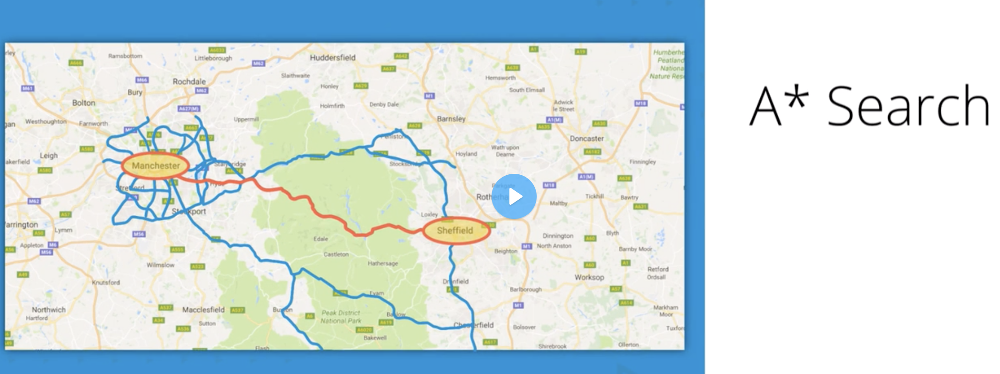

# 100 Questions about AI
## 1. What is a heuristic algorithm?
The heuristic algorithm uses constraints or rules to inform the otherwise brute-force algorithm to act in a more optimal manner. One of the most famous algorithm is the A* search algorithm that can be used to find the optimal path between two location;

 Heuristic_Algorithm.png

## 2. What is AI system or agent?
A AI system or agent should be able to react to the environment changes or even anticipate such changes. It includes the human impact or other agents' behavior, Like the game AI. The tool is also search strategy.
