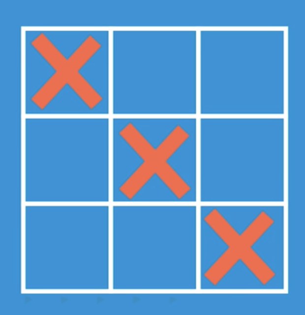
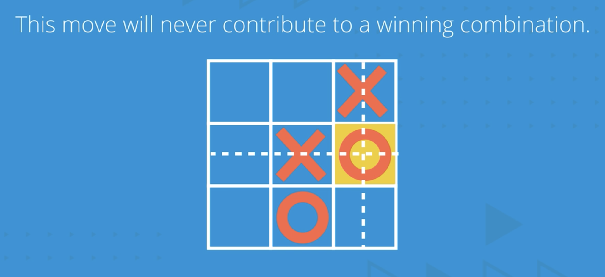
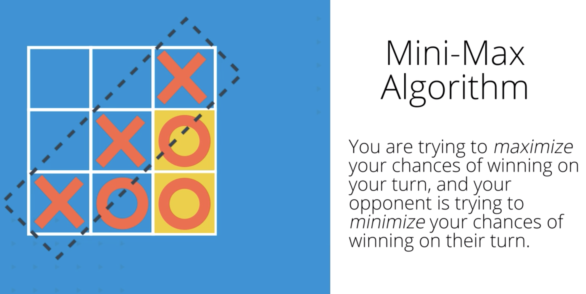

# 100 Questions about AI
## 1. What is a heuristic algorithm?
The heuristic algorithm uses constraints or rules to inform the otherwise brute-force algorithm to act in a more optimal manner. One of the most famous algorithm is the A* search algorithm that can be used to find the optimal path between two location;

<b><i>

Heuristic_Algorithm_for_Navigation</i></b>

## 2. What is the AI system or agent?
A AI system or agent should be able to react to the environment changes or even anticipate such changes. It includes the human impact or other agents' behavior, Like the game AI. The algorithm is also a search strategy.

<b><i>

Tic-Tac-Toe_Game_AI</i></b>

## 3. What dose the action "Purning the search tree" mean?
It means that we can rule out the actions that is definitely not helpful for wining the game so that we can reduce the number of moves that we need to search.

<b><i>

Puring_the_Search_Tree</i></b>

## 4. What is adversarial search and when will we use it?
"Adversarial Search" means that we want to find the best move to win the game. It happends when we are fitting with someone or some other agents. The algorithm we can use is the "Mini-Max algorithm". It means that we are trying to maximize our chance to win, and our opponent are trying to minimize our chance to wim.

It is effective because when we rule out a move as being bad, we are actually getting ride of it's potential successors from consideration.

<b><i>

Mini-Max_Algorithm</i></b>

